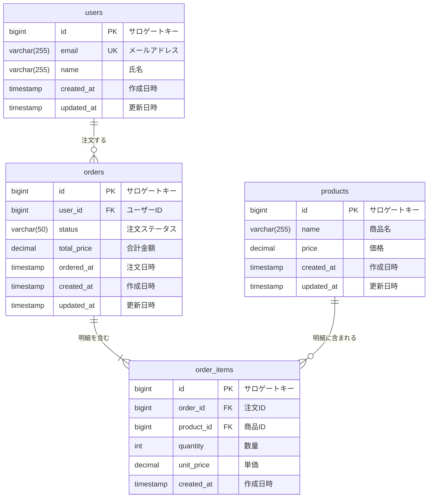

# DBテーブル定義書: [機能名/サブシステム名]

## 1. 文書情報

| 項目 | 内容 |
|------|------|
| ドキュメントID | DB-XXX |
| 対象DB | [DB名] |
| バージョン | 1.0.0 |
| 作成日 | YYYY-MM-DD |
| 最終更新日 | YYYY-MM-DD |
| 担当者 | [担当者名] |

---

## 2. ER図

---

## 3. テーブル一覧

| テーブル物理名 | テーブル論理名 | 説明 |
|--------------|--------------|------|
| users | ユーザー | システムを利用するユーザーの情報を管理する |
| orders | 注文 | ユーザーの注文ヘッダー情報を管理する |
| order_items | 注文明細 | 注文に含まれる商品の明細を管理する |
| products | 商品 | 販売する商品の情報を管理する |

---

## 4. テーブル定義

### 4.1 users（ユーザー）

**テーブル概要**
ログインアカウントを含むユーザーの基本情報を管理するテーブルです。

**カラム定義**

| カラム物理名 | カラム論理名 | データ型 | 長さ | NOT NULL | PK | FK | デフォルト値 | 説明 |
|------------|------------|---------|-----|---------|----|----|------------|------|
| id | サロゲートキー | BIGINT | - | ✓ | ✓ | - | AUTO_INCREMENT | 主キー |
| email | メールアドレス | VARCHAR | 255 | ✓ | - | - | - | ユニーク制約あり |
| name | 氏名 | VARCHAR | 255 | ✓ | - | - | - | |
| created_at | 作成日時 | TIMESTAMP | - | ✓ | - | - | CURRENT_TIMESTAMP | レコード作成日時 |
| updated_at | 更新日時 | TIMESTAMP | - | ✓ | - | - | CURRENT_TIMESTAMP | レコード最終更新日時 |

**インデックス定義**

| インデックス名 | 種別 | 対象カラム | 説明 |
|-------------|------|-----------|------|
| PRIMARY | PRIMARY KEY | id | 主キー |
| uq_users_email | UNIQUE | email | メールアドレスの重複防止 |

**制約定義**

| 制約名 | 種別 | 対象カラム | 制約内容 |
|-------|------|-----------|---------|
| uq_users_email | UNIQUE | email | メールアドレスは一意であること |

---

### 4.2 orders（注文）

**テーブル概要**
ユーザーが行った注文のヘッダー情報を管理するテーブルです。

**カラム定義**

| カラム物理名 | カラム論理名 | データ型 | 長さ | NOT NULL | PK | FK | デフォルト値 | 説明 |
|------------|------------|---------|-----|---------|----|----|------------|------|
| id | サロゲートキー | BIGINT | - | ✓ | ✓ | - | AUTO_INCREMENT | 主キー |
| user_id | ユーザーID | BIGINT | - | ✓ | - | ✓ | - | users.id を参照 |
| status | 注文ステータス | VARCHAR | 50 | ✓ | - | - | 'pending' | pending / confirmed / shipped / delivered / cancelled |
| total_price | 合計金額 | DECIMAL | 10,2 | ✓ | - | - | - | 税込合計金額 |
| ordered_at | 注文日時 | TIMESTAMP | - | ✓ | - | - | CURRENT_TIMESTAMP | 注文が確定した日時 |
| created_at | 作成日時 | TIMESTAMP | - | ✓ | - | - | CURRENT_TIMESTAMP | レコード作成日時 |
| updated_at | 更新日時 | TIMESTAMP | - | ✓ | - | - | CURRENT_TIMESTAMP | レコード最終更新日時 |

**インデックス定義**

| インデックス名 | 種別 | 対象カラム | 説明 |
|-------------|------|-----------|------|
| PRIMARY | PRIMARY KEY | id | 主キー |
| idx_orders_user_id | INDEX | user_id | ユーザーごとの注文検索 |
| idx_orders_status | INDEX | status | ステータス別の絞り込み |

**外部キー制約**

| 制約名 | 参照元カラム | 参照先テーブル | 参照先カラム | ON DELETE | ON UPDATE |
|-------|-----------|-------------|-----------|----------|----------|
| fk_orders_user_id | user_id | users | id | RESTRICT | CASCADE |

---

### 4.3 order_items（注文明細）

**テーブル概要**
1件の注文に含まれる商品の明細情報を管理するテーブルです。

**カラム定義**

| カラム物理名 | カラム論理名 | データ型 | 長さ | NOT NULL | PK | FK | デフォルト値 | 説明 |
|------------|------------|---------|-----|---------|----|----|------------|------|
| id | サロゲートキー | BIGINT | - | ✓ | ✓ | - | AUTO_INCREMENT | 主キー |
| order_id | 注文ID | BIGINT | - | ✓ | - | ✓ | - | orders.id を参照 |
| product_id | 商品ID | BIGINT | - | ✓ | - | ✓ | - | products.id を参照 |
| quantity | 数量 | INT | - | ✓ | - | - | - | 1以上であること |
| unit_price | 単価 | DECIMAL | 10,2 | ✓ | - | - | - | 注文時点の価格（商品マスタから取得してコピー） |
| created_at | 作成日時 | TIMESTAMP | - | ✓ | - | - | CURRENT_TIMESTAMP | レコード作成日時 |

**インデックス定義**

| インデックス名 | 種別 | 対象カラム | 説明 |
|-------------|------|-----------|------|
| PRIMARY | PRIMARY KEY | id | 主キー |
| idx_order_items_order_id | INDEX | order_id | 注文ごとの明細検索 |

**外部キー制約**

| 制約名 | 参照元カラム | 参照先テーブル | 参照先カラム | ON DELETE | ON UPDATE |
|-------|-----------|-------------|-----------|----------|----------|
| fk_order_items_order_id | order_id | orders | id | CASCADE | CASCADE |
| fk_order_items_product_id | product_id | products | id | RESTRICT | CASCADE |

---

### 4.4 products（商品）

**テーブル概要**
販売する商品のマスターデータを管理するテーブルです。

**カラム定義**

| カラム物理名 | カラム論理名 | データ型 | 長さ | NOT NULL | PK | FK | デフォルト値 | 説明 |
|------------|------------|---------|-----|---------|----|----|------------|------|
| id | サロゲートキー | BIGINT | - | ✓ | ✓ | - | AUTO_INCREMENT | 主キー |
| name | 商品名 | VARCHAR | 255 | ✓ | - | - | - | |
| price | 価格 | DECIMAL | 10,2 | ✓ | - | - | - | 税抜価格 |
| created_at | 作成日時 | TIMESTAMP | - | ✓ | - | - | CURRENT_TIMESTAMP | レコード作成日時 |
| updated_at | 更新日時 | TIMESTAMP | - | ✓ | - | - | CURRENT_TIMESTAMP | レコード最終更新日時 |

**インデックス定義**

| インデックス名 | 種別 | 対象カラム | 説明 |
|-------------|------|-----------|------|
| PRIMARY | PRIMARY KEY | id | 主キー |

---

## 5. 変更履歴

| バージョン | 更新日 | 担当者 | 変更内容 |
|-----------|--------|--------|---------|
| 1.0.0 | YYYY-MM-DD | [担当者名] | 初版作成 |
