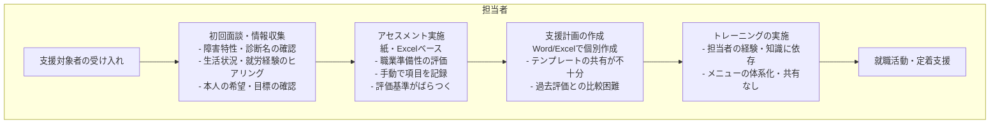
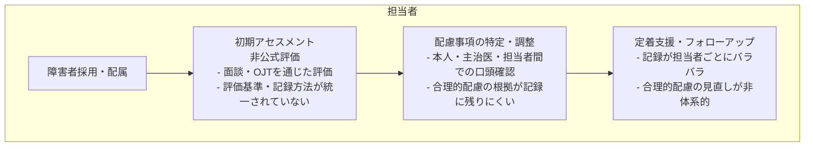
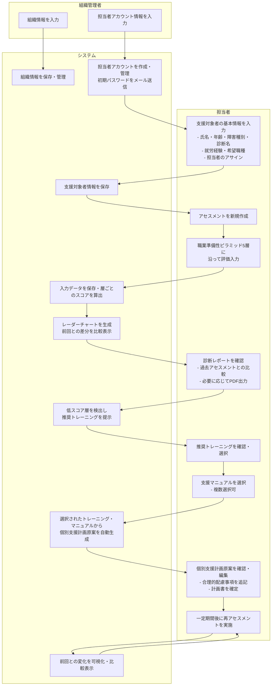
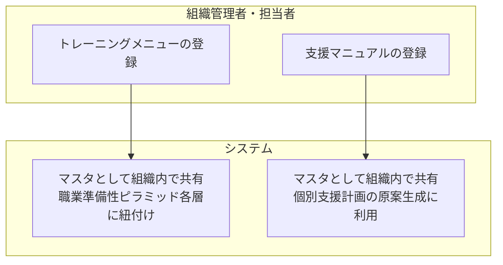

# 業務フロー図

## 概要

障害者雇用支援アセスメントシステムにおける主要な業務フローを定義します。

---

## 1. As-Is（現状フロー）

### 1-1. 就労移行支援事業所における現状フロー

**現状の課題：**
- アセスメント結果の属人化・ばらつき
- 過去評価との比較・経時変化の把握が困難
- 担当者交代時の引き継ぎコストが高い
- トレーニングメニューの知識共有ができていない
- 個別支援計画の作成に時間がかかる

---

### 1-2. 企業障害者雇用担当部署における現状フロー

---

## 2. To-Be（システム導入後フロー）

### 2-1. メインフロー（担当者視点）

---

### 2-2. 利用組織種別による業務フローの差異

| フローステップ | 就労移行支援事業所 | 企業障害者雇用担当 |
|--------------|-----------------|----------------|
| 支援対象者登録 | 訓練生として登録 | 在籍社員として登録 |
| アセスメント目的 | 就職に向けた能力評価 | 現職での適応・配慮評価 |
| トレーニング提案 | 就労移行に向けたスキル習得 | 職場定着・業務遂行支援 |
| 個別支援計画 | 就労移行支援計画 | 合理的配慮計画 |
| 利用期間 | 最大2年（制度上の期限あり） | 継続的（在籍中は継続） |

---

### 2-3. マスタ管理フロー

---

## 3. 業務フローまとめ

### 主要な業務フローの対応関係

| 業務フロー | 実施者 | システム機能 |
|-----------|--------|------------|
| 支援対象者の受け入れ | 担当者 | 支援対象者登録 |
| アセスメントの実施 | 担当者 | アセスメント実施機能 |
| 評価結果の共有・報告 | システム | 診断レポート出力 |
| 支援方針の検討 | 担当者 + システム | トレーニング提案 |
| 支援手順の決定 | 担当者 | 支援マニュアル選択 |
| 個別支援計画の作成 | 担当者 + システム | 個別支援計画原案作成 |
| マスタ管理 | 組織管理者・担当者 | トレーニングメニュー登録・支援マニュアル登録 |
| 定期的な見直し | 担当者 + システム | 再アセスメント・経時変化表示 |
