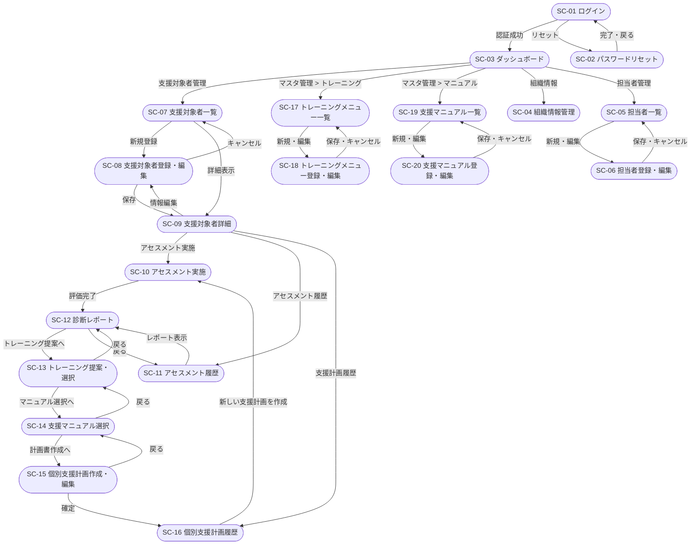
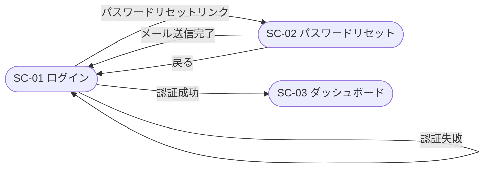
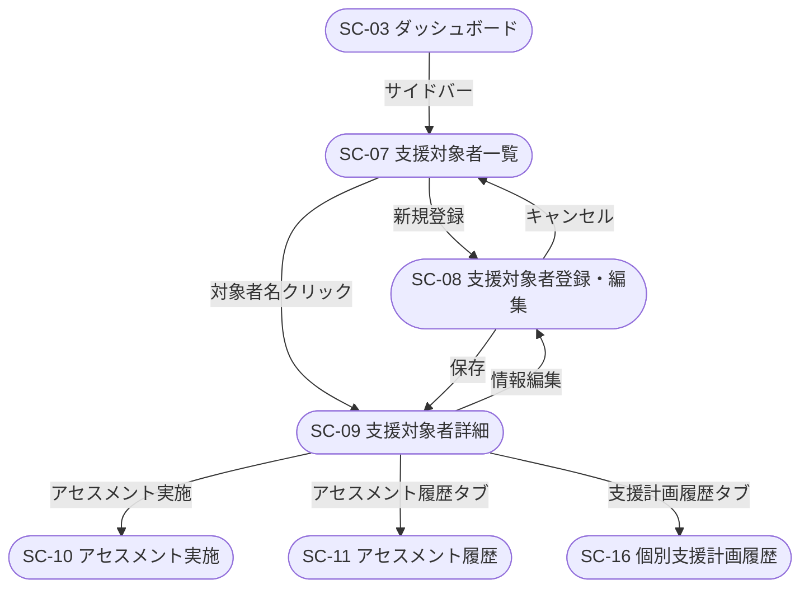
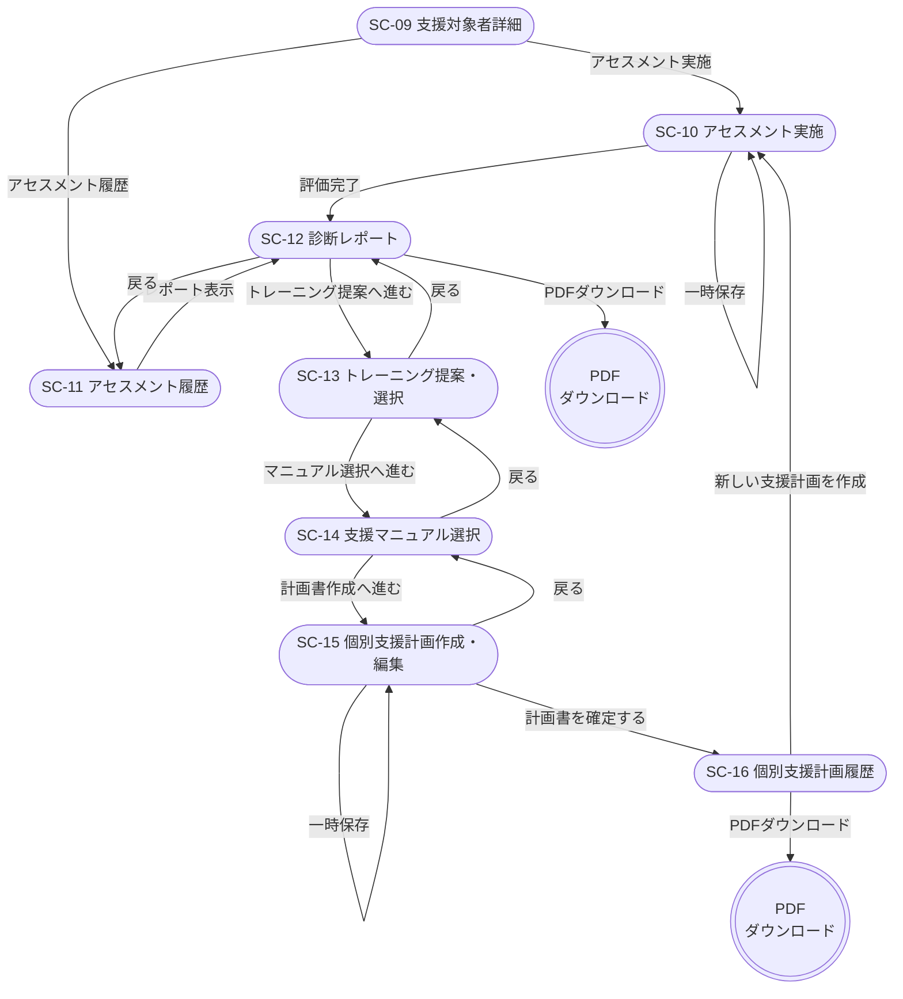
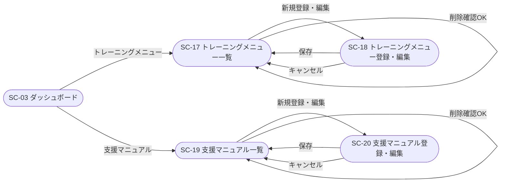
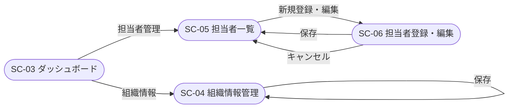

# 画面遷移図

## 概要

障害者雇用支援アセスメントシステムの全画面間の遷移フローを定義します。

---

## 1. 全体遷移図

---

## 2. 認証フロー

---

## 3. 支援対象者管理フロー

---

## 4. アセスメント〜支援計画フロー（メインフロー）

---

## 5. マスタ管理フロー

---

## 6. 組織・ユーザー設定フロー

---

## 7. 共通遷移ルール

| ルール | 内容 |
|--------|------|
| サイドバーナビ | 全画面（SC-01・SC-02 除く）からサイドバーメニューへ遷移可能 |
| ログアウト | ナビバーのログアウトリンクから SC-01 へ遷移 |
| ブレッドクラム | 階層に沿って上位画面へ戻ることができる |
| 未保存の離脱 | 入力途中で別画面へ遷移しようとした場合、確認ダイアログを表示 |
| バリデーションエラー | 必須項目未入力・入力値不正の場合、同一画面にエラーメッセージ表示 |
| セッション切れ | 一定時間操作なしの場合、SC-01 へリダイレクト |
| 権限外アクセス | ロール権限のない画面へのアクセスは SC-03 へリダイレクト |

---

## 8. 画面一覧

| 画面ID | 画面名 | カテゴリ |
|-------|-------|---------|
| SC-01 | ログイン | 認証 |
| SC-02 | パスワードリセット | 認証 |
| SC-03 | ダッシュボード | ホーム |
| SC-04 | 組織情報管理 | 組織・ユーザー設定 |
| SC-05 | 担当者一覧 | 組織・ユーザー設定 |
| SC-06 | 担当者登録・編集 | 組織・ユーザー設定 |
| SC-07 | 支援対象者一覧 | 支援対象者管理 |
| SC-08 | 支援対象者登録・編集 | 支援対象者管理 |
| SC-09 | 支援対象者詳細 | 支援対象者管理 |
| SC-10 | アセスメント実施 | アセスメント |
| SC-11 | アセスメント履歴 | アセスメント |
| SC-12 | 診断レポート | レポート |
| SC-13 | トレーニング提案・選択 | 支援計画 |
| SC-14 | 支援マニュアル選択 | 支援計画 |
| SC-15 | 個別支援計画作成・編集 | 支援計画 |
| SC-16 | 個別支援計画履歴 | 支援計画 |
| SC-17 | トレーニングメニュー一覧 | マスタ管理 |
| SC-18 | トレーニングメニュー登録・編集 | マスタ管理 |
| SC-19 | 支援マニュアル一覧 | マスタ管理 |
| SC-20 | 支援マニュアル登録・編集 | マスタ管理 |
