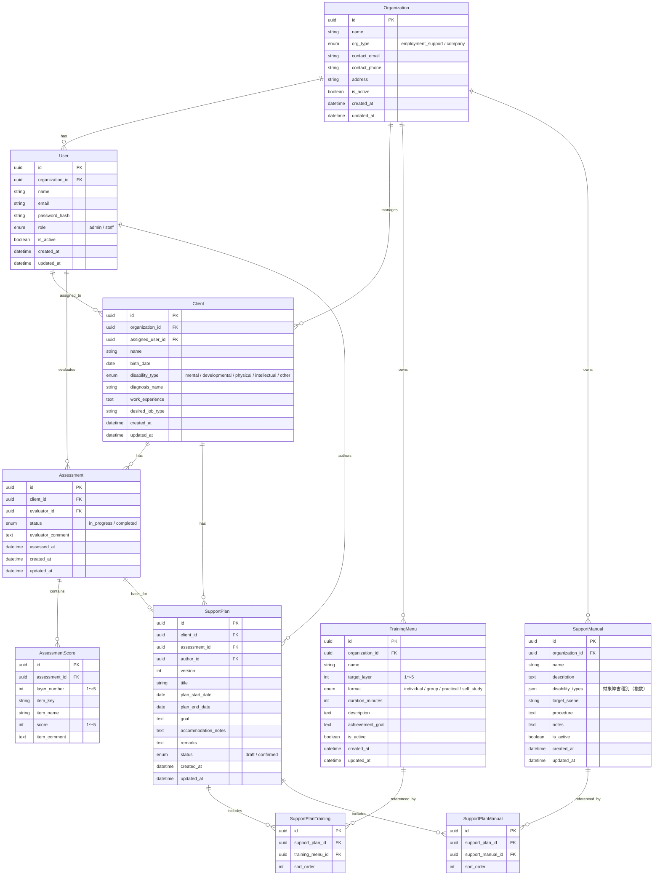
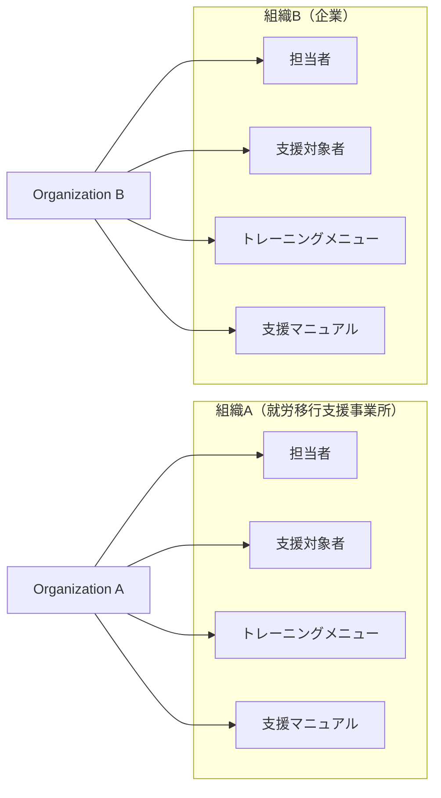

# データモデル図

## 概要

障害者雇用支援アセスメントシステムの主要エンティティとそのリレーションを定義します。

---

## 1. ER図

---

## 2. エンティティ定義

### Organization（利用組織）

| カラム | 型 | 説明 |
|-------|-----|------|
| id | UUID | 主キー |
| name | STRING | 組織名 |
| org_type | ENUM | 組織種別（`employment_support`：就労移行支援事業所 / `company`：企業） |
| contact_email | STRING | 連絡先メールアドレス |
| contact_phone | STRING | 連絡先電話番号 |
| address | STRING | 住所 |
| is_active | BOOLEAN | 有効フラグ |
| created_at / updated_at | DATETIME | 作成・更新日時 |

---

### User（担当者）

| カラム | 型 | 説明 |
|-------|-----|------|
| id | UUID | 主キー |
| organization_id | UUID FK | 所属組織 |
| name | STRING | 氏名 |
| email | STRING | メールアドレス（ログインID） |
| password_hash | STRING | ハッシュ化パスワード |
| role | ENUM | ロール（`admin`：組織管理者 / `staff`：担当者） |
| is_active | BOOLEAN | 有効フラグ（無効化で論理削除） |
| created_at / updated_at | DATETIME | 作成・更新日時 |

**ユニーク制約：** `email`

---

### Client（支援対象者）

| カラム | 型 | 説明 |
|-------|-----|------|
| id | UUID | 主キー |
| organization_id | UUID FK | 所属組織 |
| assigned_user_id | UUID FK | 担当者（NULL許容：未アサイン） |
| name | STRING | 氏名 |
| birth_date | DATE | 生年月日 |
| disability_type | ENUM | 主障害種別 |
| diagnosis_name | STRING | 診断名 |
| work_experience | TEXT | 就労経験（フリーテキスト） |
| desired_job_type | STRING | 希望職種 |
| created_at / updated_at | DATETIME | 作成・更新日時 |

---

### Assessment（アセスメント）

| カラム | 型 | 説明 |
|-------|-----|------|
| id | UUID | 主キー |
| client_id | UUID FK | 支援対象者 |
| evaluator_id | UUID FK | 評価担当者 |
| status | ENUM | 状態（`in_progress`：入力中 / `completed`：完了） |
| evaluator_comment | TEXT | 担当者コメント（レポートに表示） |
| assessed_at | DATETIME | 評価完了日時（完了時に設定） |
| created_at / updated_at | DATETIME | 作成・更新日時 |

---

### AssessmentScore（評価スコア）

| カラム | 型 | 説明 |
|-------|-----|------|
| id | UUID | 主キー |
| assessment_id | UUID FK | 対象アセスメント |
| layer_number | INT | 層番号（1〜5） |
| item_key | STRING | 評価項目識別キー（例：`layer1_sleep`） |
| item_name | STRING | 評価項目名（例：「睡眠の安定」） |
| score | INT | スコア（1〜5） |
| item_comment | TEXT | 項目別コメント（任意） |

**ユニーク制約：** `(assessment_id, item_key)`

---

### TrainingMenu（トレーニングメニュー）

| カラム | 型 | 説明 |
|-------|-----|------|
| id | UUID | 主キー |
| organization_id | UUID FK | 所属組織 |
| name | STRING | メニュー名 |
| target_layer | INT | 対象層（1〜5） |
| format | ENUM | 実施形式（個別指導 / グループワーク / 実習 / 自習） |
| duration_minutes | INT | 所要時間（分） |
| description | TEXT | 説明 |
| achievement_goal | TEXT | 達成目標 |
| is_active | BOOLEAN | 有効フラグ |
| created_at / updated_at | DATETIME | 作成・更新日時 |

---

### SupportManual（支援マニュアル）

| カラム | 型 | 説明 |
|-------|-----|------|
| id | UUID | 主キー |
| organization_id | UUID FK | 所属組織 |
| name | STRING | マニュアル名 |
| description | TEXT | 説明 |
| disability_types | JSON | 対象障害種別（複数選択のため配列で保持） |
| target_scene | STRING | 対象場面 |
| procedure | TEXT | 手順 |
| notes | TEXT | 注意点 |
| is_active | BOOLEAN | 有効フラグ |
| created_at / updated_at | DATETIME | 作成・更新日時 |

---

### SupportPlan（個別支援計画）

| カラム | 型 | 説明 |
|-------|-----|------|
| id | UUID | 主キー |
| client_id | UUID FK | 支援対象者 |
| assessment_id | UUID FK | 作成の根拠となったアセスメント |
| author_id | UUID FK | 作成担当者 |
| version | INT | バージョン番号（同一対象者内で自動採番） |
| title | STRING | 計画名称 |
| plan_start_date | DATE | 計画開始日 |
| plan_end_date | DATE | 計画終了日 |
| goal | TEXT | 目標 |
| accommodation_notes | TEXT | 合理的配慮事項 |
| remarks | TEXT | 備考・特記事項 |
| status | ENUM | 状態（`draft`：一時保存 / `confirmed`：確定） |
| created_at / updated_at | DATETIME | 作成・更新日時 |

---

### SupportPlanTraining（支援計画×トレーニングメニュー）

中間テーブル。支援計画に含まれるトレーニングメニューを管理する。

| カラム | 型 | 説明 |
|-------|-----|------|
| id | UUID | 主キー |
| support_plan_id | UUID FK | 支援計画 |
| training_menu_id | UUID FK | トレーニングメニュー |
| sort_order | INT | 表示順 |

---

### SupportPlanManual（支援計画×支援マニュアル）

中間テーブル。支援計画に適用される支援マニュアルを管理する。

| カラム | 型 | 説明 |
|-------|-----|------|
| id | UUID | 主キー |
| support_plan_id | UUID FK | 支援計画 |
| support_manual_id | UUID FK | 支援マニュアル |
| sort_order | INT | 表示順 |

---

## 3. テナント分離方針

本システムはマルチテナント構成を採用し、すべてのデータは `organization_id` によって組織ごとに分離する。

- すべてのクエリに `organization_id` の絞り込みを必須とする
- 異なる組織のデータは API レベルで相互参照不可とする
- `Organization` テーブルのみシステム管理者が管理する

---

## 4. 主要なビジネスルール

| # | ルール |
|---|--------|
| 1 | AssessmentScore の `item_key` は層ごとに固定の評価項目セットを持つ（アプリ側で定義） |
| 2 | Assessment が `completed` になると AssessmentScore は更新不可 |
| 3 | SupportPlan の `version` は同一 `client_id` 内で自動採番される |
| 4 | SupportPlan が `confirmed` になると内容は変更不可（新バージョンを作成する） |
| 5 | TrainingMenu / SupportManual を削除する場合、参照中の SupportPlan がある場合は論理削除（`is_active = false`）のみ許可 |
| 6 | Client の `assigned_user_id` は同一 `organization_id` の User のみ設定可能 |
