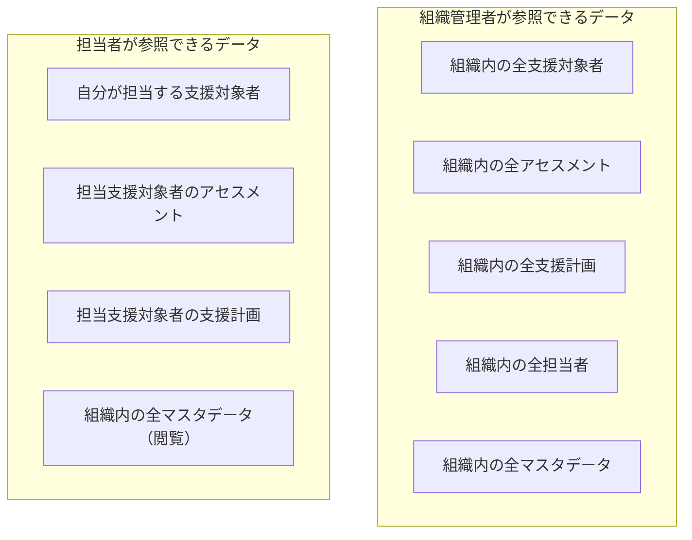

# ロール・権限定義

## 概要

障害者雇用支援アセスメントシステムにおけるロールと操作権限のマトリクスを定義します。

---

## 1. ロール定義

| ロール | 説明 | 主な対象者 |
|-------|------|-----------|
| **組織管理者** | 組織情報・担当者アカウントの管理権限を持つ。担当者としての全操作も実施可能 | 事業所長・部門長・管理担当者 |
| **担当者** | 支援対象者の登録・アセスメント・支援計画の作成を行う一般ユーザー | 支援員・障害者雇用担当スタッフ |

> 支援対象者はシステムにログインしません。担当者が情報を代理入力・管理します。

---

## 2. 権限マトリクス

凡例：`✓` 操作可能　`✗` 操作不可　`△` 条件付きで可能

### A. 組織・ユーザー管理

| 機能ID | 機能名 | 組織管理者 | 担当者 |
|-------|-------|:---------:|:------:|
| A-01 | 利用組織登録 | ✓ | ✗ |
| A-02 | 組織情報編集 | ✓ | ✗ |
| A-03 | 担当者アカウント登録 | ✓ | ✗ |
| A-04 | 担当者アカウント編集・無効化 | ✓ | ✗ |
| A-05 | ログイン・認証 | ✓ | ✓ |
| A-06 | 自身のパスワードリセット | ✓ | ✓ |

---

### B. 支援対象者管理

| 機能ID | 機能名 | 組織管理者 | 担当者 |
|-------|-------|:---------:|:------:|
| B-01 | 支援対象者登録 | ✓ | ✓ |
| B-02 | 支援対象者情報編集 | ✓ | △ ※1 |
| B-03 | 支援対象者一覧表示 | ✓ | ✓ |
| B-04 | 支援対象者詳細表示 | ✓ | △ ※2 |
| B-05 | 担当者アサイン変更 | ✓ | ✗ |

**※1** 自分が担当者としてアサインされている支援対象者の情報のみ編集可能
**※2** 自分が担当者としてアサインされている支援対象者の詳細のみ閲覧可能

---

### C. アセスメント

| 機能ID | 機能名 | 組織管理者 | 担当者 |
|-------|-------|:---------:|:------:|
| C-01 | アセスメント新規作成 | ✓ | △ ※2 |
| C-02 | アセスメント入力 | ✓ | △ ※2 |
| C-03 | アセスメント保存・完了 | ✓ | △ ※2 |
| C-04 | アセスメント履歴一覧 | ✓ | △ ※2 |
| C-05 | アセスメント編集（完了前） | ✓ | △ ※2 |
| C-06 | 経時変化の表示 | ✓ | △ ※2 |

**※2** 担当支援対象者のアセスメントのみ操作可能

---

### D. レポート

| 機能ID | 機能名 | 組織管理者 | 担当者 |
|-------|-------|:---------:|:------:|
| D-01 | 診断レポート生成・表示 | ✓ | △ ※2 |
| D-02 | 過去比較表示 | ✓ | △ ※2 |
| D-03 | レポート PDF 出力 | ✓ | △ ※2 |

---

### E. 支援計画

| 機能ID | 機能名 | 組織管理者 | 担当者 |
|-------|-------|:---------:|:------:|
| E-01 | トレーニング提案 | ✓ | △ ※2 |
| E-02 | トレーニング選択 | ✓ | △ ※2 |
| E-03 | 支援マニュアル選択 | ✓ | △ ※2 |
| E-04 | 個別支援計画原案生成 | ✓ | △ ※2 |
| E-05 | 個別支援計画編集・確定 | ✓ | △ ※2 |
| E-06 | 個別支援計画 PDF 出力 | ✓ | △ ※2 |
| E-07 | 個別支援計画履歴管理 | ✓ | △ ※2 |

---

### F. マスタ管理

| 機能ID | 機能名 | 組織管理者 | 担当者 |
|-------|-------|:---------:|:------:|
| F-01 | トレーニングメニュー登録 | ✓ | ✓ |
| F-02 | トレーニングメニュー編集・削除 | ✓ | △ ※3 |
| F-03 | トレーニングメニュー一覧表示 | ✓ | ✓ |
| F-04 | 支援マニュアル登録 | ✓ | ✓ |
| F-05 | 支援マニュアル編集・削除 | ✓ | △ ※3 |
| F-06 | 支援マニュアル一覧表示 | ✓ | ✓ |

**※3** 自分が作成したマスタデータのみ編集・削除可能。他担当者が作成したデータの変更は不可（組織管理者は全件操作可能）

---

## 3. データアクセス範囲

---

## 4. 操作制限の詳細

### 担当者の操作制限

| 制限 | 内容 |
|------|------|
| 他担当者の支援対象者 | 一覧には表示されない。詳細・アセスメント・支援計画へのアクセス不可 |
| 担当者アサイン | 自分以外への変更不可。変更は組織管理者のみ実施可能 |
| アカウント管理 | 他担当者のアカウント情報の閲覧・変更不可 |
| マスタデータ削除 | 自身が作成したもののみ削除可能 |

### 完了済みデータの変更制限

| データ | 条件 | 制限内容 |
|--------|------|---------|
| アセスメント | status = `completed` | スコアの変更不可。コメントのみ修正可能 |
| 個別支援計画 | status = `confirmed` | 内容変更不可。新バージョンを作成して対応 |

---

## 5. 画面別アクセス制御

| 画面ID | 画面名 | 組織管理者 | 担当者 |
|-------|-------|:---------:|:------:|
| SC-01 | ログイン | ✓ | ✓ |
| SC-02 | パスワードリセット | ✓ | ✓ |
| SC-03 | ダッシュボード | ✓ | ✓ |
| SC-04 | 組織情報管理 | ✓ | ✗ |
| SC-05 | 担当者一覧 | ✓ | ✗ |
| SC-06 | 担当者登録・編集 | ✓ | ✗ |
| SC-07 | 支援対象者一覧 | ✓（全件） | ✓（担当のみ） |
| SC-08 | 支援対象者登録・編集 | ✓ | ✓（担当のみ） |
| SC-09 | 支援対象者詳細 | ✓ | ✓（担当のみ） |
| SC-10 | アセスメント実施 | ✓ | ✓（担当のみ） |
| SC-11 | アセスメント履歴 | ✓ | ✓（担当のみ） |
| SC-12 | 診断レポート | ✓ | ✓（担当のみ） |
| SC-13 | トレーニング提案・選択 | ✓ | ✓（担当のみ） |
| SC-14 | 支援マニュアル選択 | ✓ | ✓（担当のみ） |
| SC-15 | 個別支援計画作成・編集 | ✓ | ✓（担当のみ） |
| SC-16 | 個別支援計画履歴 | ✓ | ✓（担当のみ） |
| SC-17 | トレーニングメニュー一覧 | ✓ | ✓ |
| SC-18 | トレーニングメニュー登録・編集 | ✓ | ✓（自作成のみ編集） |
| SC-19 | 支援マニュアル一覧 | ✓ | ✓ |
| SC-20 | 支援マニュアル登録・編集 | ✓ | ✓（自作成のみ編集） |
