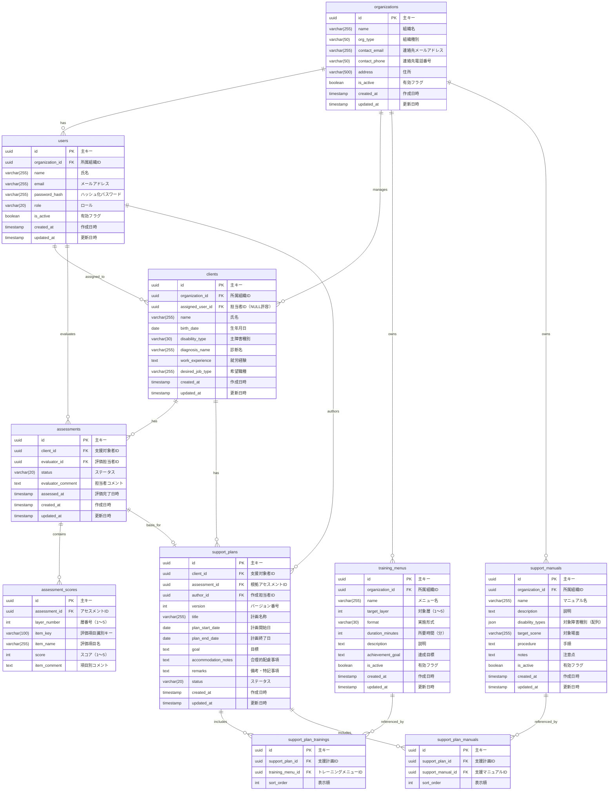

# DBテーブル定義書: 障害者雇用支援アセスメントシステム

## 1. 文書情報

| 項目 | 内容 |
|------|------|
| ドキュメントID | DB-001 |
| 対象DB | assessment_db |
| バージョン | 1.0.0 |
| 作成日 | 2026-05-18 |
| 最終更新日 | 2026-05-18 |
| 担当者 | - |

---

## 2. ER図

---

## 3. テーブル一覧

| テーブル物理名 | テーブル論理名 | 説明 |
|--------------|--------------|------|
| organizations | 利用組織 | システムを利用する組織（就労移行支援事業所・企業）の情報を管理する |
| users | 担当者 | 組織に所属する担当者のアカウント情報を管理する |
| clients | 支援対象者 | 支援を受ける障害者の基本情報を管理する |
| assessments | アセスメント | 支援対象者に対するアセスメントのヘッダー情報を管理する |
| assessment_scores | 評価スコア | アセスメント内の各評価項目のスコアを管理する |
| training_menus | トレーニングメニュー | 組織が保有するトレーニングメニューのマスタを管理する |
| support_manuals | 支援マニュアル | 組織が保有する支援マニュアルのマスタを管理する |
| support_plans | 個別支援計画 | 支援対象者ごとの個別支援計画を管理する |
| support_plan_trainings | 支援計画トレーニング | 支援計画に紐づくトレーニングメニューの中間テーブル |
| support_plan_manuals | 支援計画マニュアル | 支援計画に紐づく支援マニュアルの中間テーブル |

---

## 4. テーブル定義

### 4.1 organizations（利用組織）

**テーブル概要**
システムを利用する組織（就労移行支援事業所・企業）の情報を管理するテーブルです。マルチテナント構成の基底となるテーブルで、すべてのデータはこのテーブルの `id` によって組織単位に分離されます。

**カラム定義**

| カラム物理名 | カラム論理名 | データ型 | 長さ | NOT NULL | PK | FK | デフォルト値 | 説明 |
|------------|------------|---------|-----|---------|----|----|------------|------|
| id | 主キー | UUID | - | ✓ | ✓ | - | gen_random_uuid() | 組織ID |
| name | 組織名 | VARCHAR | 255 | ✓ | - | - | - | |
| org_type | 組織種別 | VARCHAR | 50 | ✓ | - | - | - | `employment_support`：就労移行支援事業所 / `company`：企業 |
| contact_email | 連絡先メールアドレス | VARCHAR | 255 | ✓ | - | - | - | |
| contact_phone | 連絡先電話番号 | VARCHAR | 50 | - | - | - | NULL | |
| address | 住所 | VARCHAR | 500 | - | - | - | NULL | |
| is_active | 有効フラグ | BOOLEAN | - | ✓ | - | - | TRUE | FALSE で論理削除 |
| created_at | 作成日時 | TIMESTAMP | - | ✓ | - | - | CURRENT_TIMESTAMP | |
| updated_at | 更新日時 | TIMESTAMP | - | ✓ | - | - | CURRENT_TIMESTAMP | |

**インデックス定義**

| インデックス名 | 種別 | 対象カラム | 説明 |
|-------------|------|-----------|------|
| PRIMARY | PRIMARY KEY | id | 主キー |

**制約定義**

| 制約名 | 種別 | 対象カラム | 制約内容 |
|-------|------|-----------|---------|
| chk_organizations_org_type | CHECK | org_type | `employment_support` または `company` であること |

---

### 4.2 users（担当者）

**テーブル概要**
組織に所属する担当者のログインアカウント・プロフィール情報を管理するテーブルです。`is_active = false` により論理削除を実現します。

**カラム定義**

| カラム物理名 | カラム論理名 | データ型 | 長さ | NOT NULL | PK | FK | デフォルト値 | 説明 |
|------------|------------|---------|-----|---------|----|----|------------|------|
| id | 主キー | UUID | - | ✓ | ✓ | - | gen_random_uuid() | 担当者ID |
| organization_id | 所属組織ID | UUID | - | ✓ | - | ✓ | - | organizations.id を参照 |
| name | 氏名 | VARCHAR | 255 | ✓ | - | - | - | |
| email | メールアドレス | VARCHAR | 255 | ✓ | - | - | - | ログインID。ユニーク制約あり |
| password_hash | ハッシュ化パスワード | VARCHAR | 255 | ✓ | - | - | - | bcrypt 等でハッシュ化して保存 |
| role | ロール | VARCHAR | 20 | ✓ | - | - | 'staff' | `admin`：組織管理者 / `staff`：担当者 |
| is_active | 有効フラグ | BOOLEAN | - | ✓ | - | - | TRUE | FALSE で論理削除 |
| created_at | 作成日時 | TIMESTAMP | - | ✓ | - | - | CURRENT_TIMESTAMP | |
| updated_at | 更新日時 | TIMESTAMP | - | ✓ | - | - | CURRENT_TIMESTAMP | |

**インデックス定義**

| インデックス名 | 種別 | 対象カラム | 説明 |
|-------------|------|-----------|------|
| PRIMARY | PRIMARY KEY | id | 主キー |
| uq_users_email | UNIQUE | email | メールアドレスの重複防止 |
| idx_users_organization_id | INDEX | organization_id | 組織ごとの担当者検索 |

**外部キー制約**

| 制約名 | 参照元カラム | 参照先テーブル | 参照先カラム | ON DELETE | ON UPDATE |
|-------|-----------|-------------|-----------|----------|----------|
| fk_users_organization_id | organization_id | organizations | id | RESTRICT | CASCADE |

**制約定義**

| 制約名 | 種別 | 対象カラム | 制約内容 |
|-------|------|-----------|---------|
| uq_users_email | UNIQUE | email | メールアドレスは一意であること |
| chk_users_role | CHECK | role | `admin` または `staff` であること |

---

### 4.3 clients（支援対象者）

**テーブル概要**
支援を受ける障害者の基本情報を管理するテーブルです。`assigned_user_id` が NULL の場合は担当者未アサイン状態を示します。

**カラム定義**

| カラム物理名 | カラム論理名 | データ型 | 長さ | NOT NULL | PK | FK | デフォルト値 | 説明 |
|------------|------------|---------|-----|---------|----|----|------------|------|
| id | 主キー | UUID | - | ✓ | ✓ | - | gen_random_uuid() | 支援対象者ID |
| organization_id | 所属組織ID | UUID | - | ✓ | - | ✓ | - | organizations.id を参照 |
| assigned_user_id | 担当者ID | UUID | - | - | - | ✓ | NULL | users.id を参照。NULL は未アサイン |
| name | 氏名 | VARCHAR | 255 | ✓ | - | - | - | |
| birth_date | 生年月日 | DATE | - | - | - | - | NULL | |
| disability_type | 主障害種別 | VARCHAR | 30 | ✓ | - | - | - | `mental` / `developmental` / `physical` / `intellectual` / `other` |
| diagnosis_name | 診断名 | VARCHAR | 255 | - | - | - | NULL | |
| work_experience | 就労経験 | TEXT | - | - | - | - | NULL | フリーテキスト |
| desired_job_type | 希望職種 | VARCHAR | 255 | - | - | - | NULL | |
| created_at | 作成日時 | TIMESTAMP | - | ✓ | - | - | CURRENT_TIMESTAMP | |
| updated_at | 更新日時 | TIMESTAMP | - | ✓ | - | - | CURRENT_TIMESTAMP | |

**インデックス定義**

| インデックス名 | 種別 | 対象カラム | 説明 |
|-------------|------|-----------|------|
| PRIMARY | PRIMARY KEY | id | 主キー |
| idx_clients_organization_id | INDEX | organization_id | 組織ごとの支援対象者検索 |
| idx_clients_assigned_user_id | INDEX | assigned_user_id | 担当者ごとの支援対象者検索 |

**外部キー制約**

| 制約名 | 参照元カラム | 参照先テーブル | 参照先カラム | ON DELETE | ON UPDATE |
|-------|-----------|-------------|-----------|----------|----------|
| fk_clients_organization_id | organization_id | organizations | id | RESTRICT | CASCADE |
| fk_clients_assigned_user_id | assigned_user_id | users | id | SET NULL | CASCADE |

**制約定義**

| 制約名 | 種別 | 対象カラム | 制約内容 |
|-------|------|-----------|---------|
| chk_clients_disability_type | CHECK | disability_type | `mental` / `developmental` / `physical` / `intellectual` / `other` のいずれかであること |

---

### 4.4 assessments（アセスメント）

**テーブル概要**
支援対象者に対するアセスメントのヘッダー情報を管理するテーブルです。`status = 'completed'` になると `assessment_scores` の更新が不可となります。

**カラム定義**

| カラム物理名 | カラム論理名 | データ型 | 長さ | NOT NULL | PK | FK | デフォルト値 | 説明 |
|------------|------------|---------|-----|---------|----|----|------------|------|
| id | 主キー | UUID | - | ✓ | ✓ | - | gen_random_uuid() | アセスメントID |
| client_id | 支援対象者ID | UUID | - | ✓ | - | ✓ | - | clients.id を参照 |
| evaluator_id | 評価担当者ID | UUID | - | ✓ | - | ✓ | - | users.id を参照 |
| status | ステータス | VARCHAR | 20 | ✓ | - | - | 'in_progress' | `in_progress`：入力中 / `completed`：完了 |
| evaluator_comment | 担当者コメント | TEXT | - | - | - | - | NULL | レポートに表示されるコメント |
| assessed_at | 評価完了日時 | TIMESTAMP | - | - | - | - | NULL | status が completed になった時刻 |
| created_at | 作成日時 | TIMESTAMP | - | ✓ | - | - | CURRENT_TIMESTAMP | |
| updated_at | 更新日時 | TIMESTAMP | - | ✓ | - | - | CURRENT_TIMESTAMP | |

**インデックス定義**

| インデックス名 | 種別 | 対象カラム | 説明 |
|-------------|------|-----------|------|
| PRIMARY | PRIMARY KEY | id | 主キー |
| idx_assessments_client_id | INDEX | client_id | 支援対象者ごとのアセスメント検索 |
| idx_assessments_evaluator_id | INDEX | evaluator_id | 担当者ごとのアセスメント検索 |
| idx_assessments_status | INDEX | status | ステータス別の絞り込み |

**外部キー制約**

| 制約名 | 参照元カラム | 参照先テーブル | 参照先カラム | ON DELETE | ON UPDATE |
|-------|-----------|-------------|-----------|----------|----------|
| fk_assessments_client_id | client_id | clients | id | RESTRICT | CASCADE |
| fk_assessments_evaluator_id | evaluator_id | users | id | RESTRICT | CASCADE |

**制約定義**

| 制約名 | 種別 | 対象カラム | 制約内容 |
|-------|------|-----------|---------|
| chk_assessments_status | CHECK | status | `in_progress` または `completed` であること |

---

### 4.5 assessment_scores（評価スコア）

**テーブル概要**
アセスメント内の各評価項目のスコアを管理するテーブルです。`(assessment_id, item_key)` の組み合わせは一意です。`score` の有効範囲は 1〜5 で、N/A は NULL で表現します。

**カラム定義**

| カラム物理名 | カラム論理名 | データ型 | 長さ | NOT NULL | PK | FK | デフォルト値 | 説明 |
|------------|------------|---------|-----|---------|----|----|------------|------|
| id | 主キー | UUID | - | ✓ | ✓ | - | gen_random_uuid() | スコアID |
| assessment_id | アセスメントID | UUID | - | ✓ | - | ✓ | - | assessments.id を参照 |
| layer_number | 層番号 | INT | - | ✓ | - | - | - | 1〜5（第1層：健康管理〜第5層：職業適性） |
| item_key | 評価項目識別キー | VARCHAR | 100 | ✓ | - | - | - | 例：`layer1_sleep`、`layer3_communication` |
| item_name | 評価項目名 | VARCHAR | 255 | ✓ | - | - | - | 例：「睡眠管理」、「会話・コミュニケーション」 |
| score | スコア | INT | - | - | - | - | NULL | 1〜5。N/A の場合は NULL |
| item_comment | 項目別コメント | TEXT | - | - | - | - | NULL | 任意入力 |

**インデックス定義**

| インデックス名 | 種別 | 対象カラム | 説明 |
|-------------|------|-----------|------|
| PRIMARY | PRIMARY KEY | id | 主キー |
| uq_assessment_scores_key | UNIQUE | assessment_id, item_key | 同一アセスメント内での項目重複防止 |
| idx_assessment_scores_assessment_id | INDEX | assessment_id | アセスメントごとのスコア取得 |

**外部キー制約**

| 制約名 | 参照元カラム | 参照先テーブル | 参照先カラム | ON DELETE | ON UPDATE |
|-------|-----------|-------------|-----------|----------|----------|
| fk_assessment_scores_assessment_id | assessment_id | assessments | id | CASCADE | CASCADE |

**制約定義**

| 制約名 | 種別 | 対象カラム | 制約内容 |
|-------|------|-----------|---------|
| chk_assessment_scores_layer | CHECK | layer_number | 1 以上 5 以下であること |
| chk_assessment_scores_score | CHECK | score | NULL または 1 以上 5 以下であること |

---

### 4.6 training_menus（トレーニングメニュー）

**テーブル概要**
組織が保有するトレーニングメニューのマスタデータを管理するテーブルです。支援計画から参照される場合は `is_active = false` による論理削除のみ許可します。

**カラム定義**

| カラム物理名 | カラム論理名 | データ型 | 長さ | NOT NULL | PK | FK | デフォルト値 | 説明 |
|------------|------------|---------|-----|---------|----|----|------------|------|
| id | 主キー | UUID | - | ✓ | ✓ | - | gen_random_uuid() | トレーニングメニューID |
| organization_id | 所属組織ID | UUID | - | ✓ | - | ✓ | - | organizations.id を参照 |
| name | メニュー名 | VARCHAR | 255 | ✓ | - | - | - | |
| target_layer | 対象層 | INT | - | ✓ | - | - | - | 1〜5 |
| format | 実施形式 | VARCHAR | 30 | ✓ | - | - | - | `individual`：個別指導 / `group`：グループワーク / `practical`：実習 / `self_study`：自習 |
| duration_minutes | 所要時間（分） | INT | - | - | - | - | NULL | |
| description | 説明 | TEXT | - | - | - | - | NULL | |
| achievement_goal | 達成目標 | TEXT | - | - | - | - | NULL | |
| is_active | 有効フラグ | BOOLEAN | - | ✓ | - | - | TRUE | FALSE で論理削除 |
| created_at | 作成日時 | TIMESTAMP | - | ✓ | - | - | CURRENT_TIMESTAMP | |
| updated_at | 更新日時 | TIMESTAMP | - | ✓ | - | - | CURRENT_TIMESTAMP | |

**インデックス定義**

| インデックス名 | 種別 | 対象カラム | 説明 |
|-------------|------|-----------|------|
| PRIMARY | PRIMARY KEY | id | 主キー |
| idx_training_menus_organization_id | INDEX | organization_id | 組織ごとのメニュー検索 |
| idx_training_menus_target_layer | INDEX | target_layer | 対象層による絞り込み |

**外部キー制約**

| 制約名 | 参照元カラム | 参照先テーブル | 参照先カラム | ON DELETE | ON UPDATE |
|-------|-----------|-------------|-----------|----------|----------|
| fk_training_menus_organization_id | organization_id | organizations | id | RESTRICT | CASCADE |

**制約定義**

| 制約名 | 種別 | 対象カラム | 制約内容 |
|-------|------|-----------|---------|
| chk_training_menus_target_layer | CHECK | target_layer | 1 以上 5 以下であること |
| chk_training_menus_format | CHECK | format | `individual` / `group` / `practical` / `self_study` のいずれかであること |

---

### 4.7 support_manuals（支援マニュアル）

**テーブル概要**
組織が保有する支援マニュアルのマスタデータを管理するテーブルです。`disability_types` は複数の障害種別を JSON 配列で保持します。支援計画から参照される場合は `is_active = false` による論理削除のみ許可します。

**カラム定義**

| カラム物理名 | カラム論理名 | データ型 | 長さ | NOT NULL | PK | FK | デフォルト値 | 説明 |
|------------|------------|---------|-----|---------|----|----|------------|------|
| id | 主キー | UUID | - | ✓ | ✓ | - | gen_random_uuid() | 支援マニュアルID |
| organization_id | 所属組織ID | UUID | - | ✓ | - | ✓ | - | organizations.id を参照 |
| name | マニュアル名 | VARCHAR | 255 | ✓ | - | - | - | |
| description | 説明 | TEXT | - | - | - | - | NULL | |
| disability_types | 対象障害種別 | JSON | - | ✓ | - | - | '[]' | 複数選択のため JSON 配列で保持。例：`["mental","developmental"]` |
| target_scene | 対象場面 | VARCHAR | 255 | - | - | - | NULL | |
| procedure | 手順 | TEXT | - | - | - | - | NULL | |
| notes | 注意点 | TEXT | - | - | - | - | NULL | |
| is_active | 有効フラグ | BOOLEAN | - | ✓ | - | - | TRUE | FALSE で論理削除 |
| created_at | 作成日時 | TIMESTAMP | - | ✓ | - | - | CURRENT_TIMESTAMP | |
| updated_at | 更新日時 | TIMESTAMP | - | ✓ | - | - | CURRENT_TIMESTAMP | |

**インデックス定義**

| インデックス名 | 種別 | 対象カラム | 説明 |
|-------------|------|-----------|------|
| PRIMARY | PRIMARY KEY | id | 主キー |
| idx_support_manuals_organization_id | INDEX | organization_id | 組織ごとのマニュアル検索 |

**外部キー制約**

| 制約名 | 参照元カラム | 参照先テーブル | 参照先カラム | ON DELETE | ON UPDATE |
|-------|-----------|-------------|-----------|----------|----------|
| fk_support_manuals_organization_id | organization_id | organizations | id | RESTRICT | CASCADE |

---

### 4.8 support_plans（個別支援計画）

**テーブル概要**
支援対象者ごとの個別支援計画を管理するテーブルです。`version` は同一 `client_id` 内で自動採番されます。`status = 'confirmed'` になると内容変更が不可となり、変更が必要な場合は新バージョンを作成します。

**カラム定義**

| カラム物理名 | カラム論理名 | データ型 | 長さ | NOT NULL | PK | FK | デフォルト値 | 説明 |
|------------|------------|---------|-----|---------|----|----|------------|------|
| id | 主キー | UUID | - | ✓ | ✓ | - | gen_random_uuid() | 支援計画ID |
| client_id | 支援対象者ID | UUID | - | ✓ | - | ✓ | - | clients.id を参照 |
| assessment_id | 根拠アセスメントID | UUID | - | ✓ | - | ✓ | - | assessments.id を参照 |
| author_id | 作成担当者ID | UUID | - | ✓ | - | ✓ | - | users.id を参照 |
| version | バージョン番号 | INT | - | ✓ | - | - | - | 同一 client_id 内で 1 から自動採番 |
| title | 計画名称 | VARCHAR | 255 | ✓ | - | - | - | |
| plan_start_date | 計画開始日 | DATE | - | - | - | - | NULL | |
| plan_end_date | 計画終了日 | DATE | - | - | - | - | NULL | |
| goal | 目標 | TEXT | - | - | - | - | NULL | |
| accommodation_notes | 合理的配慮事項 | TEXT | - | - | - | - | NULL | |
| remarks | 備考・特記事項 | TEXT | - | - | - | - | NULL | |
| status | ステータス | VARCHAR | 20 | ✓ | - | - | 'draft' | `draft`：一時保存 / `confirmed`：確定 |
| created_at | 作成日時 | TIMESTAMP | - | ✓ | - | - | CURRENT_TIMESTAMP | |
| updated_at | 更新日時 | TIMESTAMP | - | ✓ | - | - | CURRENT_TIMESTAMP | |

**インデックス定義**

| インデックス名 | 種別 | 対象カラム | 説明 |
|-------------|------|-----------|------|
| PRIMARY | PRIMARY KEY | id | 主キー |
| uq_support_plans_version | UNIQUE | client_id, version | 同一支援対象者内でバージョン重複防止 |
| idx_support_plans_client_id | INDEX | client_id | 支援対象者ごとの計画検索 |
| idx_support_plans_assessment_id | INDEX | assessment_id | アセスメントごとの計画検索 |
| idx_support_plans_author_id | INDEX | author_id | 担当者ごとの計画検索 |
| idx_support_plans_status | INDEX | status | ステータス別の絞り込み |

**外部キー制約**

| 制約名 | 参照元カラム | 参照先テーブル | 参照先カラム | ON DELETE | ON UPDATE |
|-------|-----------|-------------|-----------|----------|----------|
| fk_support_plans_client_id | client_id | clients | id | RESTRICT | CASCADE |
| fk_support_plans_assessment_id | assessment_id | assessments | id | RESTRICT | CASCADE |
| fk_support_plans_author_id | author_id | users | id | RESTRICT | CASCADE |

**制約定義**

| 制約名 | 種別 | 対象カラム | 制約内容 |
|-------|------|-----------|---------|
| uq_support_plans_version | UNIQUE | client_id, version | 同一支援対象者内でバージョンは一意であること |
| chk_support_plans_status | CHECK | status | `draft` または `confirmed` であること |
| chk_support_plans_version | CHECK | version | 1 以上であること |

---

### 4.9 support_plan_trainings（支援計画トレーニング）

**テーブル概要**
支援計画に紐づくトレーニングメニューを管理する中間テーブルです。`sort_order` で表示順を制御します。

**カラム定義**

| カラム物理名 | カラム論理名 | データ型 | 長さ | NOT NULL | PK | FK | デフォルト値 | 説明 |
|------------|------------|---------|-----|---------|----|----|------------|------|
| id | 主キー | UUID | - | ✓ | ✓ | - | gen_random_uuid() | ID |
| support_plan_id | 支援計画ID | UUID | - | ✓ | - | ✓ | - | support_plans.id を参照 |
| training_menu_id | トレーニングメニューID | UUID | - | ✓ | - | ✓ | - | training_menus.id を参照 |
| sort_order | 表示順 | INT | - | ✓ | - | - | - | 昇順で表示 |

**インデックス定義**

| インデックス名 | 種別 | 対象カラム | 説明 |
|-------------|------|-----------|------|
| PRIMARY | PRIMARY KEY | id | 主キー |
| uq_support_plan_trainings | UNIQUE | support_plan_id, training_menu_id | 同一支援計画内での重複登録防止 |
| idx_spt_support_plan_id | INDEX | support_plan_id | 支援計画ごとのトレーニング取得 |

**外部キー制約**

| 制約名 | 参照元カラム | 参照先テーブル | 参照先カラム | ON DELETE | ON UPDATE |
|-------|-----------|-------------|-----------|----------|----------|
| fk_spt_support_plan_id | support_plan_id | support_plans | id | CASCADE | CASCADE |
| fk_spt_training_menu_id | training_menu_id | training_menus | id | RESTRICT | CASCADE |

---

### 4.10 support_plan_manuals（支援計画マニュアル）

**テーブル概要**
支援計画に紐づく支援マニュアルを管理する中間テーブルです。`sort_order` で表示順を制御します。

**カラム定義**

| カラム物理名 | カラム論理名 | データ型 | 長さ | NOT NULL | PK | FK | デフォルト値 | 説明 |
|------------|------------|---------|-----|---------|----|----|------------|------|
| id | 主キー | UUID | - | ✓ | ✓ | - | gen_random_uuid() | ID |
| support_plan_id | 支援計画ID | UUID | - | ✓ | - | ✓ | - | support_plans.id を参照 |
| support_manual_id | 支援マニュアルID | UUID | - | ✓ | - | ✓ | - | support_manuals.id を参照 |
| sort_order | 表示順 | INT | - | ✓ | - | - | - | 昇順で表示 |

**インデックス定義**

| インデックス名 | 種別 | 対象カラム | 説明 |
|-------------|------|-----------|------|
| PRIMARY | PRIMARY KEY | id | 主キー |
| uq_support_plan_manuals | UNIQUE | support_plan_id, support_manual_id | 同一支援計画内での重複登録防止 |
| idx_spm_support_plan_id | INDEX | support_plan_id | 支援計画ごとのマニュアル取得 |

**外部キー制約**

| 制約名 | 参照元カラム | 参照先テーブル | 参照先カラム | ON DELETE | ON UPDATE |
|-------|-----------|-------------|-----------|----------|----------|
| fk_spm_support_plan_id | support_plan_id | support_plans | id | CASCADE | CASCADE |
| fk_spm_support_manual_id | support_manual_id | support_manuals | id | RESTRICT | CASCADE |

---

## 5. 変更履歴

| バージョン | 更新日 | 担当者 | 変更内容 |
|-----------|--------|--------|---------|
| 1.0.0 | 2026-05-18 | - | 初版作成 |
