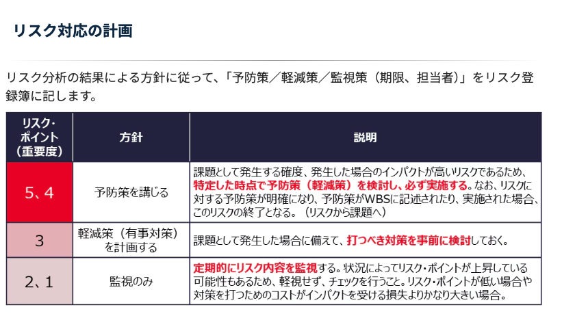

## 肝となること
- 細かくすると自分の首を絞めるので、簡潔にしておく
- 言った言わないの水掛け論になることを防ぐ仕組みを用意する

## 目次
- プロジェクト概要
- スケジュール（および各フェーズの解説）
- スコープ
- ステークホルダー
- コスト
- 品質管理
- 資源管理
- コミュニケーション管理
- 進捗管理
- 課題管理
- 変更管理
- リスク管理

## プロジェクト概要

- プロジェクト背景（提案書に記載のものを流用）
- プロジェクトの目的・ゴール
    - 提案書に記載のものを流用するが、ちょっとフワフワしている気がするので、書けるならもう少し具体的に書く。
    - 具体的には、これこれこういう機能を通して、こういうアウトプットを得れるようにする、といったとこまで記載できればベスト

## スケジュール（および各フェーズの解説）

大枠としてどういう工程を踏んでプロジェクトのゴールへ向かっていくかを明記する

- マスタースケジュール（提案書に記載のものを流用）
- フェーズ定義と完了条件
    - 各フェーズで行う内容と、完了条件の明記
- フェーズゲートレビューの実施（※）
    - 出揃った成果物をもとに、本当に次のフェーズに対して不足がないか再度確認を行う
    - リスクの発生状況や対応状況を報告する
- 要件定義・設計工程後の再見積の実施

※フェーズゲートレビューで「まだできてません」は意味がわからないので、基本的には普段のやりとりによって完了を示しておいた上で、最終確認として行う程度

## スコープ

プロジェクトスコープ（要求事項の範囲）と、そのための成果物や作業について明らかにする

また、プロジェクトスコープについては、やらないことを**きちんと**明記する（言った言わないの水掛け論になるので）

- プロジェクトスコープ
    - 提案書に記載の機能一覧を記載
    - また、コア機能を実現するために、機能一覧に記載のものでは物理的に整合性が取れない場合の補完機能
        - 例えば、「ユーザー追加」の前提には「事業所追加」が必要なのにそれがなかったら、「事業所追加」機能を設ける
    - やらないこと（例）
        - 既存システムの解析
        - システムへの生成AIの組み込み
        - エンドユーザーへの導入
        - システム利用教育
- 成果物一覧
    - 提案書に記載の成果物一覧を記載する

## ステークホルダー

- ステークホルダーの洗い出しと、各ステークホルダーの役割を記載する。
- 弊社側については、メンバーレベルでロールを記載する。（承認者についても明記する）
- やりとりをするお客さん（各工程でフロントに立たれる方）についても明記する

## コスト（お値段）

- 何にどのくらいお値段がかかっているのかを明らかにする
- コストが増える場合はどうするかも明らかにする
- また、コストが増えるかもしれないと事前にわかっていることは明記する

どのくらいの値段かかるか、or これこれこういう懸念がある、というむね

## 品質管理

- 使用する品質基準について明記する。（ISO/IEC 25010など）
- また、対象の工程や成果物ごとに、品質基準のどの項目について留意すべきか、必要に応じてどういったメトリクスが必要かを明記する

## 資源管理

- 使う資源とその理由について明記する
    
    （例：人員、クラウド環境(stg, prd), バージョン管理システム, コミュニケーションツール、資料作成のためのツール）
    

## コミュニケーション管理

- **どのような会議があるのか明記する**

    （例：キックオフ、進捗会議、要件確認会議、フェーズ完了報告会議…）

- **どのようなコミュニケーションツールを用いるのかを明記する**

    （例：打ち合わせ：Teams, 　課題管理: GitHub Projects）

- また、どのようなルールで扱うかも明記する

    （チャネルの分け方、フォルダ管理…）

- **議事録の管理・承認方法を明記する**
    
    言った言わないの水掛け論になるリスクを潰すために、議事録を残すのと、その承認を両社で行う
    

- **エスカレーションフローを明記する（option）**
    
    情報の流れを整理する
    
    例：
    
    - メンバーの人が質問あるときはPM通す
    - 会議で話す内容は内部リハーサルをしておいて事前に共有しておく

## 進捗管理

- 何を使用して、どのように進捗を管理するか記載する
    
    （現状、GitHub Projectsを使用するのが良いと考えている。お客さんにも利用の説明の必要があれば説明の場を別途設ける）

参考

https://qiita.com/bon10/items/ce77034a88c1b44c51f7

※後続の、「課題管理」「変更管理」も大きい括りでは、進捗に対するものなので、大項目としては「進捗管理」？
（お客さんから見た時には、課題だろうが変更だろうが、こっちが対応するものはこっちの進捗でしかなさそう）

## 課題管理
当初の計画を阻害する要因となっている（なる可能性があるものはリスクとして扱う。という意味で、「なった」）要素を記載する
仕様の整合性の観点から、お客さんが記載することもある

課題管理表として別紙として扱う
（課題内容、対応者、完了予定日などを記載）

## 変更管理
声の大きいステークホルダーに変更要求を押し込まれ、当初計画にないタスクが縦横無尽に追加される可能性を排除することを目的とする
（ということを、すごくマイルドに記載する）

変更管理表は別紙として扱う
（変更内容、影響度、要否、承認状況などを記載）

## リスク管理

- 計画段階で想定されるリスクを特定し、リスク管理表（別紙として扱う）へ記載しておく
- リスクは、プロジェクト活動中不定期に発生しうるので、随時再評価してリスクの特定に注力する旨を記載する

リスク管理表の内容

- リスクが顕在化する確率
- リスク顕在化の際の影響度
- 上記2つをもとにした、リスクの重要度
- リスク対応の計画

